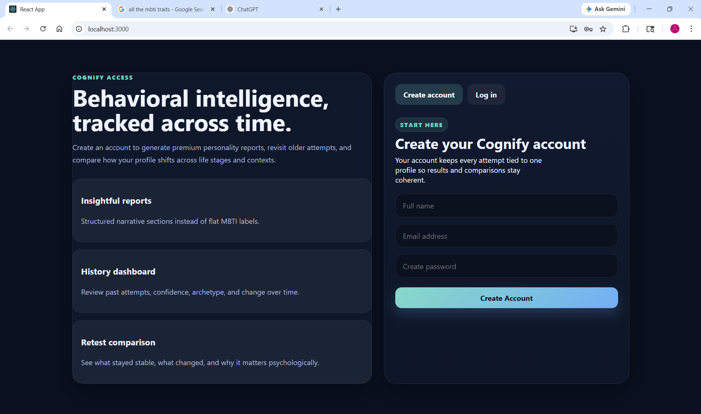
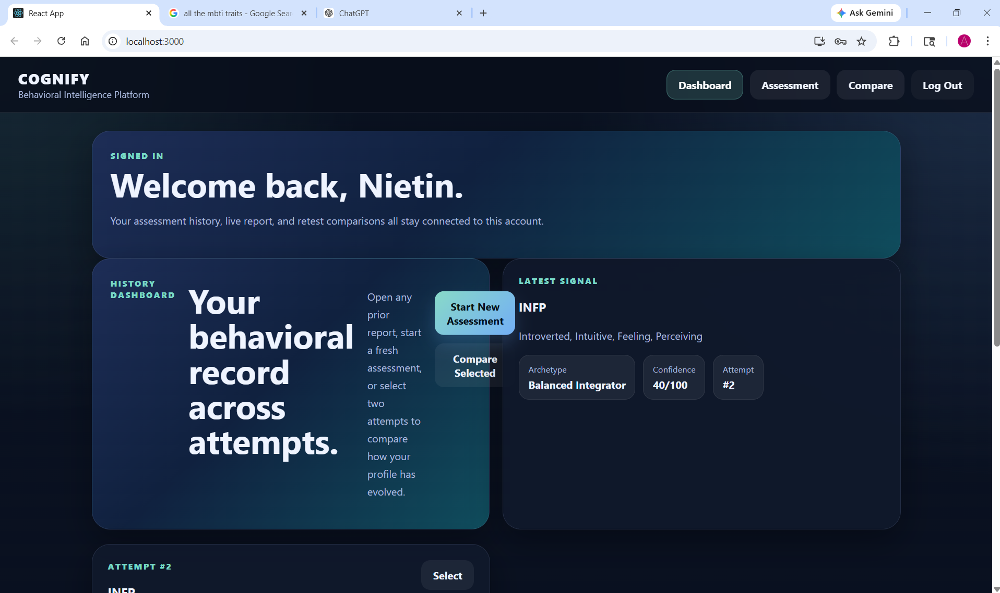
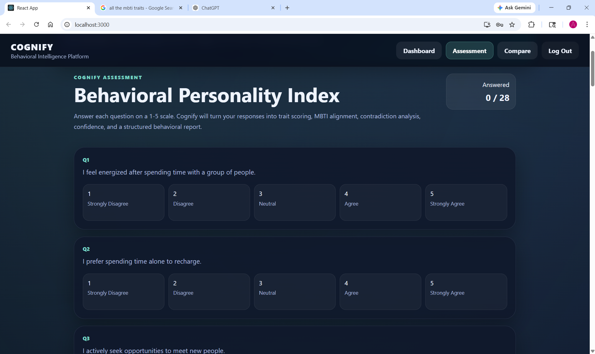
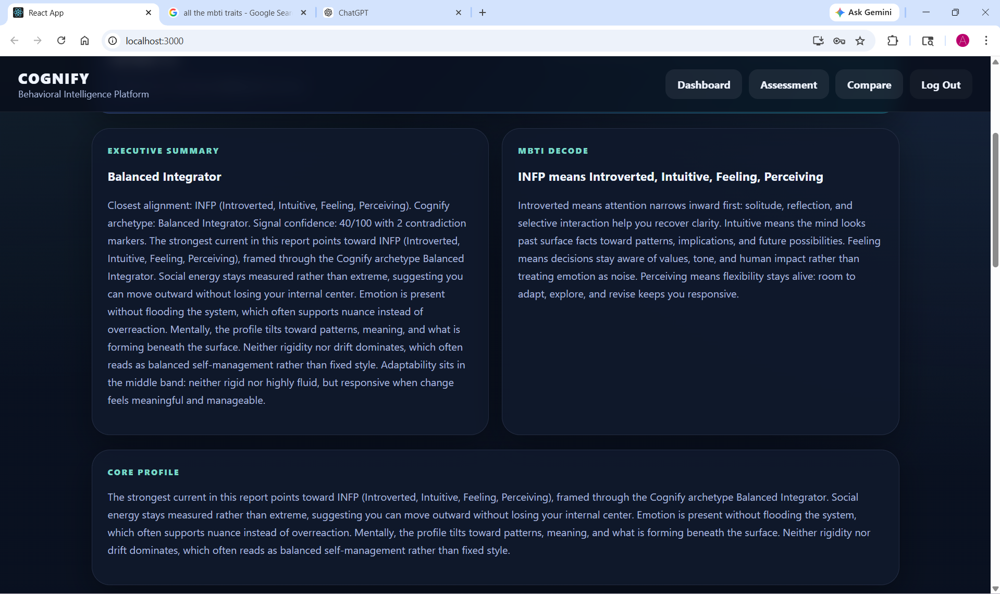
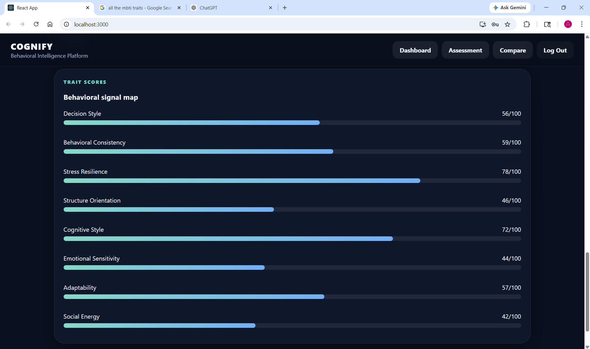
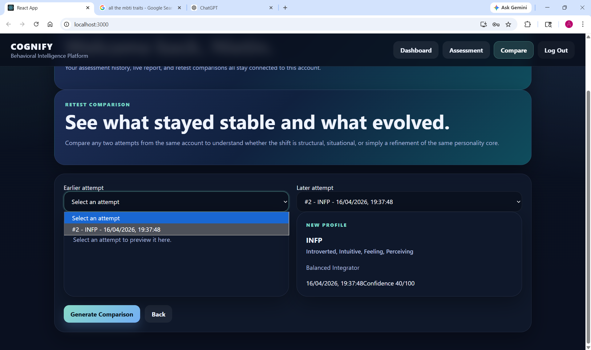

# Cognify

Cognify is a behavioral intelligence platform built with Spring Boot, React, and MySQL.

It goes beyond static personality typing by analyzing behavioral patterns, contradictions, confidence, and changes across multiple assessment attempts.

## Product Preview

### 1. Signup & Access
Users can create an account and access a personalized behavioral intelligence workflow.


### 2. Dashboard
The dashboard surfaces the latest profile, archetype, confidence, and attempt-linked navigation.


### 3. Behavioral Assessment
Users respond to a structured 1–5 scale assessment designed to capture trait signals, contradictions, and response consistency.


### 4. Results Report
The system generates a narrative personality report with MBTI alignment, archetype mapping, and structured interpretation.


### 5. Trait Score Map
Cognify visualizes behavioral dimensions such as decision style, stress resilience, adaptability, and social energy.


### 6. Retest Comparison
Users can compare two attempts to understand what remained stable and what evolved across time.


## Features

- Behavioral assessment engine
- MBTI alignment with expanded interpretation
- Contradiction detection
- Confidence scoring
- Archetype generation
- Multi-attempt comparison
- Signup and login flow
- Responsive full-stack web interface

## Tech Stack

**Backend**
- Java
- Spring Boot
- Spring Data JPA
- Hibernate

**Frontend**
- React
- Axios
- CSS

**Database**
- MySQL

## Core Idea

Traditional personality tools assign a label. Cognify tries to understand the pattern behind the label.

It takes user responses, maps them into behavioral dimensions, detects inconsistencies, calculates confidence, and generates a structured report with narrative insights.

## Current Capabilities

- User authentication flow
- Assessment question fetch from backend
- Trait scoring engine
- MBTI and archetype mapping
- Contradiction analysis
- Rich result generation
- Historical comparison across attempts

## Run Locally

### Backend
Configure your database credentials in `application.properties` and run:

```bash
./mvnw spring-boot:run
